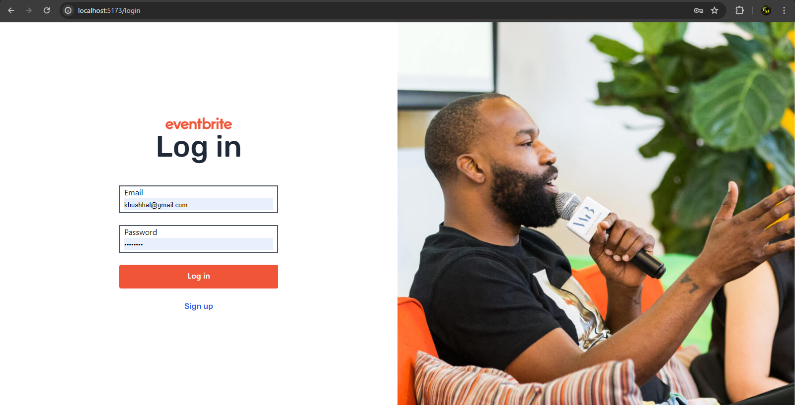
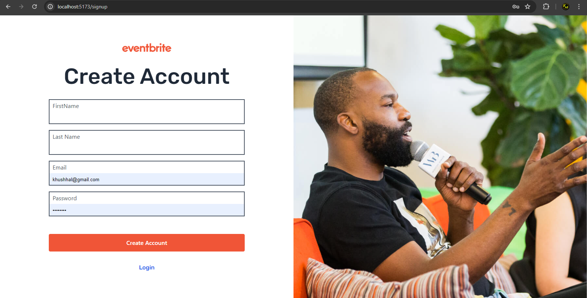
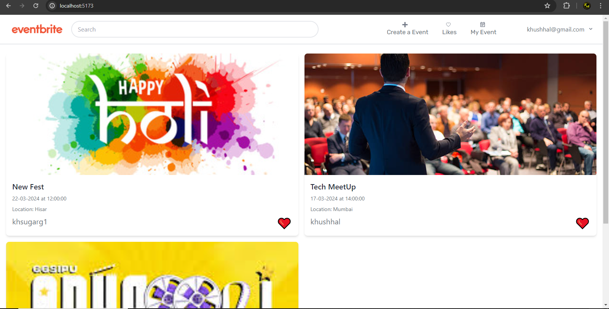
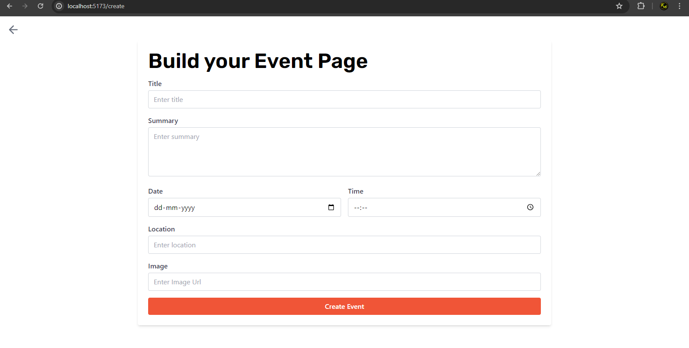
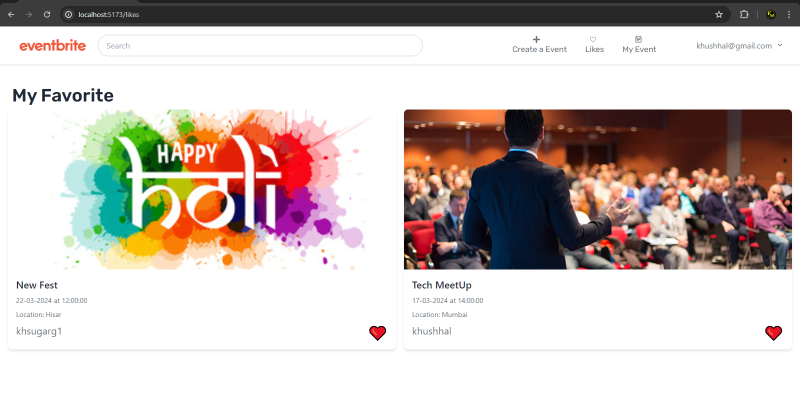
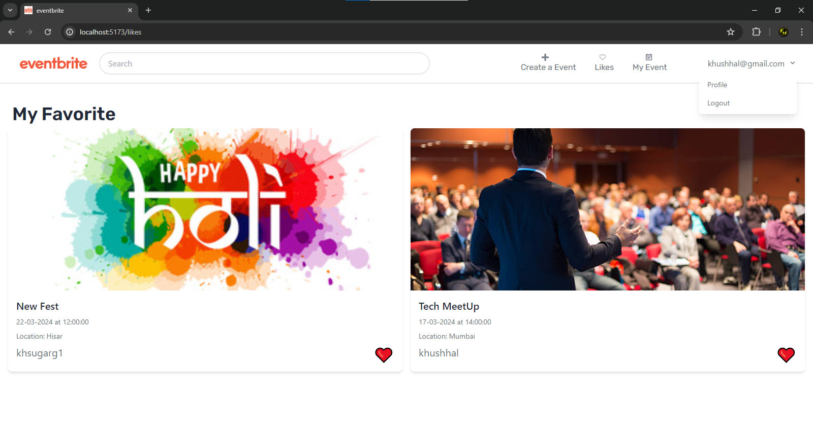

# Eventbrite

Eventbrite is a web application for managing events, built using React, Django REST Framework, MySQL database, and Tailwind CSS.

## Features

- **Authentication**: User authentication is handled using Django backend. Users can sign up and log in to access the application.
- **Create Event**: Authenticated users can create new events by filling out a form.
- **Like Events**: Users can like events, and their like status is saved. Liked events can be viewed on the "Likes" page.
- **My Events**: Users can view events they have created on the "My Events" page.
- **Responsive Design**: The application is semi-responsive, adapting to various screen sizes.

## Screenshots









## Installation

1. **Clone the Repository**:
  ```
  git clone <repository-url>
  ```

2. **Backend Setup**:
- Navigate to the `backend` directory.
- Install dependencies:
  ```
  pip install -r requirements.txt
  ```
- Run migrations:
  ```
  python manage.py migrate
  ```
- Start the Django server:
  ```
  python manage.py runserver
  ```

3. **Frontend Setup**:
- Navigate to the `frontend` directory.
- Install dependencies:
  ```
  npm install
  ```
- Start the React development server:
  ```
  npm start
  ```


## Technologies Used

- React
- Django REST Framework
- MySQL
- Tailwind CSS

## License

This project is licensed under the [MIT License](LICENSE).
